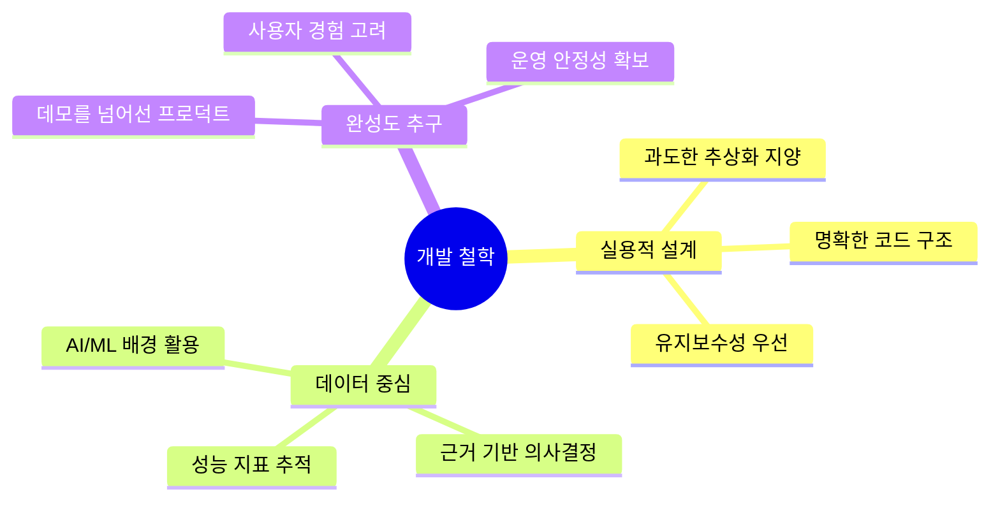

# 최찬우 (Chanwoo Choi)

### **AI로봇학과** × **Spring Boot 백엔드** 백엔드&AI 개발자

 

---

## **Signature Projects**

<table>
<tr>
<td width="50%" valign="top">

### **Toy_4** 
**AI × Backend 마이크로서비스**

**Core:** AI 일기분석 + RAG 대화시스템

**Tech Stack:**

**Deploy:** Docker Compose 멀티서비스

**Features**
- OpenAI API 기반 감정/이벤트 추출
- ChromaDB RAG 대화형 AI
- Spring Boot 백엔드 통합 아키텍처

</td>
<td width="50%" valign="top">

### **ShoppingMall**
**풀스택 전자상거래 플랫폼**

**Core:** 완성형 온라인 서점 시스템

**Tech Stack:**

**Payment:** 카카오페이 연동

**Features**
- 사용자/관리자 역할 기반 시스템
- 실시간 장바구니 & 주문 플로우
- 재고 관리 및 매출 대시보드

</td>
</tr>
</table>

### **ML Disease Prediction**
**생활습관 기반 질병 예측 모델**

AI 로봇학과에서 배운 머신러닝을 실전에 적용한 프로젝트

**Core:** 생활습관 데이터 기반 질병 예측

**Tech Stack:**

**Workflow:** EDA → Feature Engineering → Model Training → Evaluation → Visualization

**Achievements**
- 당뇨병 예측 정확도 **85%+** 달성
- RandomForest vs SVM vs Logistic 성능 비교 분석
- 자동화된 ML 파이프라인 구축

---

## **Tech Arsenal**

### **Backend & Database**

### **AI & Machine Learning**

### **Frontend & DevOps**

---

## **Development Philosophy**

**실용적 설계** — 과도한 추상화보다는 명확하고 유지보수 가능한 아키텍처  
**데이터 중심** — AI/ML 배경을 살린 데이터 기반 의사결정과 성능 최적화  
**완성도 추구** — 단순한 데모가 아닌 실제 서비스로 사용 가능한

---

## **GitHub Stats**

---

## **What Makes Me Different**

<table>
<tr>
<td align="center" width="33%">

### **전공 배경**
전공에서 습득한  
머신러닝/데이터 분석 역량

</td>
<td align="center" width="33%">

### **백엔드**
Spring Boot 생태계 기반  
확장 가능한 시스템 설계

</td>
<td align="center" width="33%">

### **융합적 사고**
AI와 백엔드를 자연스럽게  
연결하는 통합적 접근

</td>
</tr>
</table>

---

### **Let's Connect & Build Something Amazing**

*"AI의 가능성과 백엔드의 안정성을 결합해 더 나은 사용자 경험을 만들어갑니다"*

