<div align="center">

# 최찬우 (Chanwoo Choi) 👋

### 🤖 **AI 로봇학과 출신** × **Spring Boot 백엔드** 융합 개발자

> *"머신러닝의 지능과 백엔드의 안정성을 결합해 혁신적인 서비스를 만듭니다"*

<br>

[](https://github.com/choichanwoo001)
[](mailto:jonadan3495@gmail.com)

</div>

---

## 🚀 **Signature Projects**

<table>
<tr>
<td width="50%" valign="top">

### 🤖 **Toy_4** 
**AI × Backend 마이크로서비스**

```yaml
🎯 Core: AI 일기분석 + RAG 대화시스템
🔧 Tech: FastAPI • Spring Boot • ChromaDB
🐳 Deploy: Docker Compose 멀티서비스
```

**Features**
- 🧠 OpenAI API 기반 감정/이벤트 추출
- 💬 ChromaDB RAG 대화형 AI
- 🔗 Spring Boot 백엔드 통합 아키텍처

[](https://github.com/choichanwoo001/Toy_4)

</td>
<td width="50%" valign="top">

### 📚 **ShoppingMall**
**풀스택 전자상거래 플랫폼**

```yaml
🎯 Core: 완성형 온라인 서점 시스템
🔧 Tech: Spring Boot • JPA • MySQL
💰 Payment: 카카오페이 연동
```

**Features**
- 👥 사용자/관리자 역할 기반 시스템
- 🛒 실시간 장바구니 & 주문 플로우
- 📊 재고 관리 및 매출 대시보드

[](https://github.com/choichanwoo001/ShoppingMall)

</td>
</tr>
</table>

### 🎲 **ML Disease Prediction**
**생활습관 기반 질병 예측 모델**

AI 로봇학과에서 배운 머신러닝을 실전에 적용한 프로젝트

```python
# 핵심 워크플로우
EDA → Feature Engineering → Model Training → Evaluation → Visualization
```

**Achievements**
- 🎯 당뇨병 예측 정확도 **85%+** 달성
- 📊 RandomForest vs SVM vs Logistic 성능 비교 분석
- 🔄 완전 자동화된 ML 파이프라인 구축

[](https://github.com/choichanwoo001/Machine_Learning-AI-Projects)

---

## ⚡ **Tech Arsenal**

<div align="center">

### **Backend & Database**


### **AI & Machine Learning**


### **Frontend & DevOps**


</div>

---

## 🎨 **Development Philosophy**

```mermaid
mindmap
  root((개발 철학))
    실용적 설계
      과도한 추상화 지양
      명확한 코드 구조
      유지보수성 우선
    데이터 중심
      AI/ML 배경 활용
      근거 기반 의사결정
      성능 지표 추적
    완성도 추구
      POC를 넘어선 프로덕트
      사용자 경험 고려
      운영 안정성 확보
```

<div align="center">



</div>

**🔧 실용적 설계** — 과도한 추상화보다는 명확하고 유지보수 가능한 아키텍처  
**📊 데이터 중심** — AI/ML 배경을 살린 데이터 기반 의사결정과 성능 최적화  
**🚀 완성도 추구** — POC가 아닌 실제 사용 가능한 프로덕트 레벨 개발

---

## 📊 **GitHub Stats**

<div align="center">


</div>

---

## 🌟 **What Makes Me Different**

<div align="center">
<table>
<tr>
<td align="center" width="33%">

### 🎓 **AI 전공 배경**
로봇학과에서 습득한  
머신러닝/데이터 분석 역량

</td>
<td align="center" width="33%">

### 🏗️ **견고한 백엔드**
Spring Boot 생태계 기반  
확장 가능한 시스템 설계

</td>
<td align="center" width="33%">

### 🚀 **융합적 사고**
AI와 백엔드를 자연스럽게  
연결하는 통합적 접근

</td>
</tr>
</table>
</div>

---

<div align="center">

### 📬 **Let's Connect & Build Something Amazing**

[](https://github.com/choichanwoo001)
[](mailto:jonadan3495@gmail.com)

*"AI의 가능성과 백엔드의 안정성을 결합해 더 나은 사용자 경험을 만들어갑니다"*

</div>


